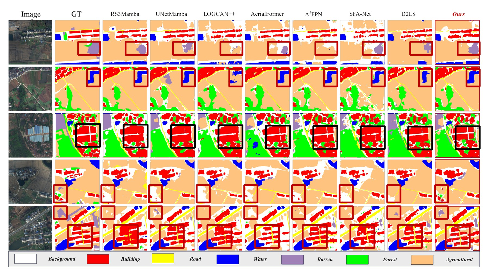
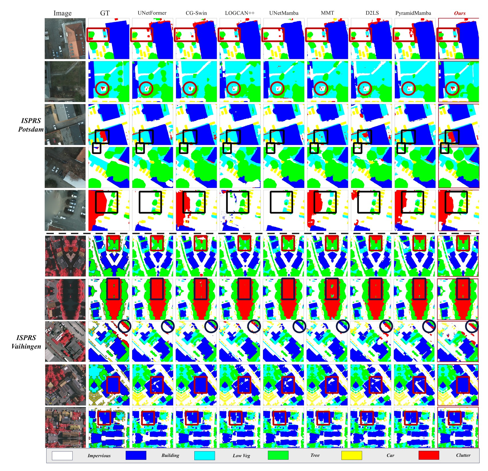
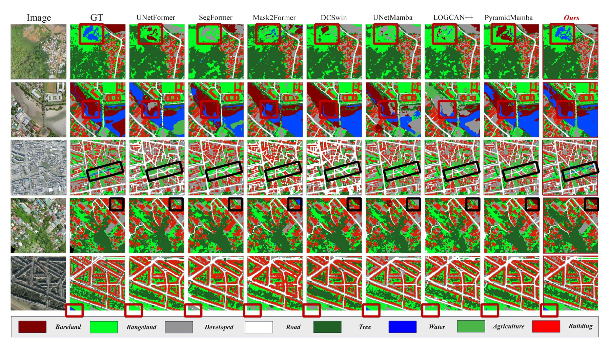

<div align="center">

# HAFR-Net

### Hierarchical Adaptive Feature Refinement Network<br>for VHR Remote Sensing Image Segmentation

<sub>Official implementation &nbsp;&middot;&nbsp; IEEE TGRS (under review)</sub>

<p>
<a href="#-citation"></a>
<a href="https://github.com/anticipate218/HAFRNet/releases/tag/weights-loveda-v1"></a>
<a href="https://github.com/anticipate218/HAFRNet/releases"></a>


<a href="LICENSE"></a>

</p>



</div>

This repository is the official implementation of **HAFR-Net**, a Swin-Base framework for semantic
segmentation of very-high-resolution (VHR) aerial imagery. HAFR-Net *refines* a pretrained encoder
instead of replacing it with a monolithic decoder: the encoder hierarchy passes three sequential
refinement stages, each of which starts from a conservative state, so the added capacity behaves as a
bounded correction and fine-tuning stays stable on the relatively small VHR benchmarks. Under a
matched Swin-B protocol with single-scale inference it reaches **84.12 / 87.86 / 55.17 / 67.70** mIoU
on ISPRS Vaihingen, ISPRS Potsdam, LoveDA and OpenEarthMap (**84.48 / 88.20** on the two ISPRS sets
with flip/rotation TTA).

## 🔥 News

- **2026-08** &nbsp;🔥 **New** &nbsp;LoveDA best checkpoint released &mdash; [`weights-loveda-v1`](https://github.com/anticipate218/HAFRNet/releases/tag/weights-loveda-v1) (val mIoU 55.17).
- **2026-08** &nbsp;Manuscript submitted to *IEEE Transactions on Geoscience and Remote Sensing*; this repository is now public.

## ✨ Highlights

- **Progressive refinement of a pretrained hierarchy.** Three sequential stages with distinct roles &mdash; dense stage adaptation, bounded spectral correction, structure and class-relation regularization &mdash; instead of one unconstrained task-specific decoder.
- **Conservative initialization.** The fusion gate starts at uniform 1/4 weights (exactly the mean-fusion baseline), the spectral branch starts at an exact residual identity, and the boundary feedback starts at a small residual coefficient. The three behaviours are stated separately rather than merged into one identity claim.
- **Matched-protocol evidence.** One Swin-B encoder, identical splits, schedule, augmentation, deep supervision and single-scale inference across all reported rows, so every margin is attributable to the decoding path.
- **Consistent gains.** +0.55 to +1.84 pp mIoU over the matched UPerNet reference on four benchmarks (+0.33 to +1.52 pp over the strongest alternative decoder), for 8.5 M extra parameters and 11% more GFLOPs.
- **Fully reported cost.** 97.8 M parameters, 131.2 GFLOPs, 24.8 ms latency and 40.3 FPS at 512&times;512 under one timing protocol, and the fixed preparation blocks are measured separately rather than folded into the margin.

## 🧩 Method

<div align="center">

**Swin-B encoder** &rarr; *stage preparation (fixed)* &rarr; **1 &middot; HG-SAF** &rarr; **2 &middot; FRA** &rarr; **3 &middot; CATP** &rarr; **mask**

</div>

HAFR-Net keeps the pretrained hierarchy and refines it progressively. Each stage has one role, and
each begins close to the representation it refines.

| # | Refinement stage | What it does | State at step 0 |
|:--:|---|---|---|
| **1** | **HG-SAF**<br>Heterogeneity-Guided<br>Stage-Adaptive Fusion | Predicts per-pixel softmax weights over the four prepared encoder stages from a local feature-heterogeneity statistic, so the decoding scale can vary inside a single tile. | Gate projection = 0 &rarr; uniform 1/4 fusion, i.e. exactly the mean-fusion baseline |
| **2** | **FRA**<br>Frequency-Residual<br>Adapter | Corrects the fused feature in the spectrum instead of replacing it: a residual rFFT branch in a channel bottleneck with a tanh-bounded per-coefficient gain (`g = 1 + alpha * tanh(.)`, `alpha = 0.5`). | Residual scale `gamma = 0` &rarr; exact identity w.r.t. the fused feature |
| **3** | **CATP**<br>Confusion-Aware<br>Tri-Prior Decoder | Decodes under boundary, objectness and prototype-contrast priors, the last on a class-pair relation set frozen from a training-only pilot split. Only the semantic head runs at inference. | Boundary feedback `beta_e = 0.05` &rarr; a small residual, not an identity |

**Measured behaviour.** HG-SAF gains +1.57 pp mIoU in the highest heterogeneity quartile and
+1.52 pp on small objects, against +0.19 pp on large objects. FRA is the best variant on all five
accuracy metrics against matched spatial and spectral alternatives at the same insertion point,
including a zero-init GFNet mixer. CATP reduces confusion mass on the pre-declared class pairs by
23&ndash;28%.

**Not claimed as contributions.** A fixed preparation trunk sits between the encoder and the three
refinement stages: SSDB (Spectral-Spatial Decoupled Block) at the two high-resolution stages,
BCS-Mamba (Bi-directional Cross-Scan Mamba) at the two low-resolution stages, and an SOE (Small
Object Enhancement) block on the fused path. They are held identical in every module study and
measured on their own: +0.22 pp of the +0.55 pp Vaihingen margin, with the remaining +0.33 pp
attributable to the three refinement stages.

## 📊 Results

Matched protocol: one Swin-B encoder, identical splits, schedule and augmentation, single-scale
inference for every entry.

<div align="center">

| Dataset | Classes | mIoU (%) | + flip/rot TTA |
|---|:--:|:--:|:--:|
| ISPRS Vaihingen | 5 scored | 84.12 | **84.48** |
| ISPRS Potsdam | 5 scored | 87.86 | **88.20** |
| LoveDA (official val) | 7 | **55.17** | &mdash; |
| OpenEarthMap | 8 | **67.70** | &mdash; |

</div>

Margins over the matched UPerNet reference are +0.55, +0.95, +1.55 and +1.84 pp, with paired
bootstrap 95% confidence intervals of [0.31, 0.79], [0.66, 1.22], [1.18, 1.91] and [1.47, 2.19] pp
over the evaluation patches; all four exclude zero. Every entry is the mean over seeds 42, 43 and 44.
Published results for the same benchmarks appear in the paper as literature context only, since
backbones and inference settings differ across sources.

## 📦 Model Zoo

<div align="center">

| Dataset | mIoU (%) | Checkpoint |
|---|:--:|:--:|
| LoveDA | 55.17 | [`HAFRNet_loveda_best.pth`](https://github.com/anticipate218/HAFRNet/releases/tag/weights-loveda-v1) (478 MB) |
| ISPRS Vaihingen | 84.48 | upon acceptance |
| ISPRS Potsdam | 88.20 | upon acceptance |
| OpenEarthMap | 67.70 | upon acceptance |

</div>

Checkpoints are attached to the [Releases](https://github.com/anticipate218/HAFRNet/releases) page and
are not tracked in git history.

```python
import torch

ck = torch.load("HAFRNet_loveda_best.pth", map_location="cpu")
print(ck["best_miou"], ck["best_is_ema"])    # 0.5517  True
model.load_state_dict(ck["model_state_dict"])
model.eval()
```

The archive stores `model_state_dict`, `best_miou`, `best_is_ema`, `epoch` and `history` (per-epoch
`val_miou`, `val_class_iou` and their EMA variants). The LoveDA entry holds the **EMA shadow
weights**, the setting the LoveDA number is reported under. Top-level keys of the state dict are
`_swin_full`, `ssdb_stages`, `mamba_stages`, `proj_pre`, `hg_saf`, `fra`, `soe`, `decoder` and
`aux_heads`; the `aux_heads` tensors are deep-supervision heads used during training only.

## 🖼️ Visualizations

<details open>
<summary><b>ISPRS Vaihingen and Potsdam</b></summary>
<br>

<sub>Boxes mark vehicles and boundaries between adjacent classes, the regions discussed in the HG-SAF and CATP analyses.</sub>
</details>

<details>
<summary><b>LoveDA</b></summary>
<br>

<sub>Boxes mark thin rural roads and low-texture <i>Barren</i> regions.</sub>
</details>

<details>
<summary><b>OpenEarthMap</b></summary>
<br>

<sub>Boxes mark <i>Rangeland</i>&nbsp;&harr;&nbsp;<i>Agriculture</i> transitions and thin roads, the pair with the largest confusion-mass reduction from CATP.</sub>
</details>

## 🚀 Getting Started

### Installation

```bash
# Python 3.10+, one CUDA GPU (all reported runs used a single RTX 4090)
pip install torch torchvision        # match your CUDA build
pip install timm numpy opencv-python pillow tqdm
pip install mamba-ssm                # BCS-Mamba preparation stages
```

The backbone is the `timm` checkpoint `swin_base_patch4_window12_384.ms_in22k_ft_in1k`
(ImageNet-22k pretrained, ImageNet-1k fine-tuned), downloaded automatically by `timm`.

### Datasets

| Dataset | Classes | GSD | Bands | Download |
|---|:--:|:--:|:--:|---|
| ISPRS Vaihingen | 6 (5 scored) | 9 cm | IR-R-G | [ISPRS](https://www.isprs.org/education/benchmarks/UrbanSemLab/) |
| ISPRS Potsdam | 6 (5 scored) | 5 cm | R-G-B | [ISPRS](https://www.isprs.org/education/benchmarks/UrbanSemLab/) |
| LoveDA | 7 | 30 cm | R-G-B | [LoveDA](https://github.com/Junjue-Wang/LoveDA) |
| OpenEarthMap | 8 | 25&ndash;50 cm | R-G-B | [OpenEarthMap](https://open-earth-map.org/) |

On the two ISPRS benchmarks the five foreground classes are scored, *Clutter* is excluded, and the
official 3-px boundary erosion is applied.

### Training

```bash
python train_hafrnet_unified.py --dataset vaihingen --data_root /path/to/Vaihingen
python train_hafrnet_unified.py --dataset potsdam   --data_root /path/to/Potsdam
python train_hafrnet_unified.py --dataset loveda    --data_root /path/to/LoveDA
python train_hafrnet_unified.py --dataset oem       --data_root /path/to/OpenEarthMap
```

Every image enters the network at 512&times;512 (the ISPRS tiles are held as non-overlapping
1024&times;1024 patches and resampled, labels by nearest neighbour); at most 80 epochs at batch size 8;
AdamW with head learning rate 1.2e-4 and backbone learning rate 4e-5; cosine schedule with a 5-epoch
warm-up; weight decay 1e-4; gradient clipping at L2 norm 1; BF16 mixed precision with the spectral
FFTs in FP32. Augmentation is horizontal or vertical flip plus discrete 90&deg; rotation, each with
probability 0.5. No CRF, multi-crop merging or other post-processing is applied.

LoveDA adds a stronger photometric recipe on top: colour jitter 0.4, Gaussian blur 0.3, an EMA shadow
model with decay 0.999, and early stopping with patience 12; its reported number is the EMA mIoU.
Seeds are 42, 43 and 44, and the kept checkpoint is the one with the best validation mIoU.

### Evaluation

Each run writes `history.json` with per-epoch `val_miou` and `val_class_iou` (plus the EMA variants)
and saves the best checkpoint under `checkpoints/`.

## 🗺️ Roadmap

- [x] LoveDA best checkpoint
- [ ] Training and evaluation code &mdash; *upon acceptance*
- [ ] Vaihingen, Potsdam and OpenEarthMap checkpoints &mdash; *upon acceptance*
- [ ] Configuration files reproducing every table of the paper
- [ ] Architecture figure and module diagrams

## 📝 Citation

```bibtex
@article{hafrnet2026,
  title   = {Hierarchical Adaptive Feature Refinement Network for VHR Remote Sensing
             Image Segmentation},
  journal = {IEEE Transactions on Geoscience and Remote Sensing},
  year    = {2026},
  note    = {Under review; the full bibliographic record will be added upon publication}
}
```

## 🙏 Acknowledgement

Built on [`timm`](https://github.com/huggingface/pytorch-image-models) for the Swin-B backbone, and on
the public ISPRS, [LoveDA](https://github.com/Junjue-Wang/LoveDA) and
[OpenEarthMap](https://open-earth-map.org/) benchmarks. We thank the teams that maintain these
datasets.

## ⚖️ License

Released under the [MIT License](LICENSE) for academic research use.

## 💬 Contact

Questions are welcome through the
[issue tracker](https://github.com/anticipate218/HAFRNet/issues). Correspondence details will be
added once the paper is published.
